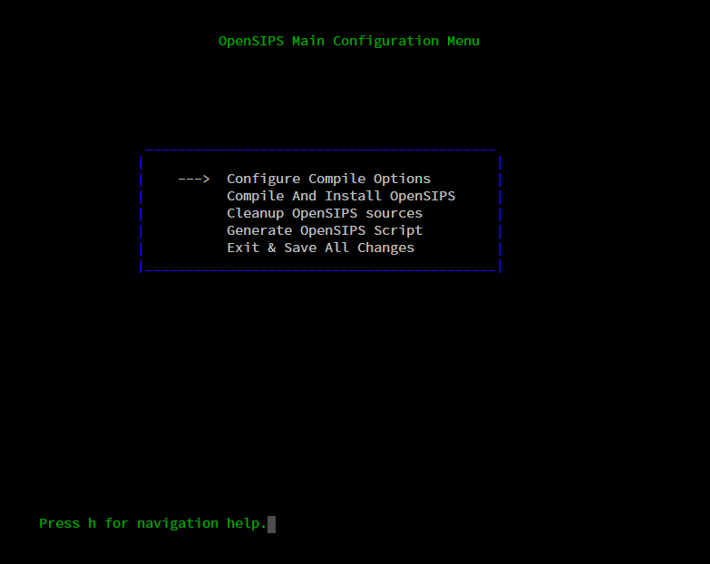
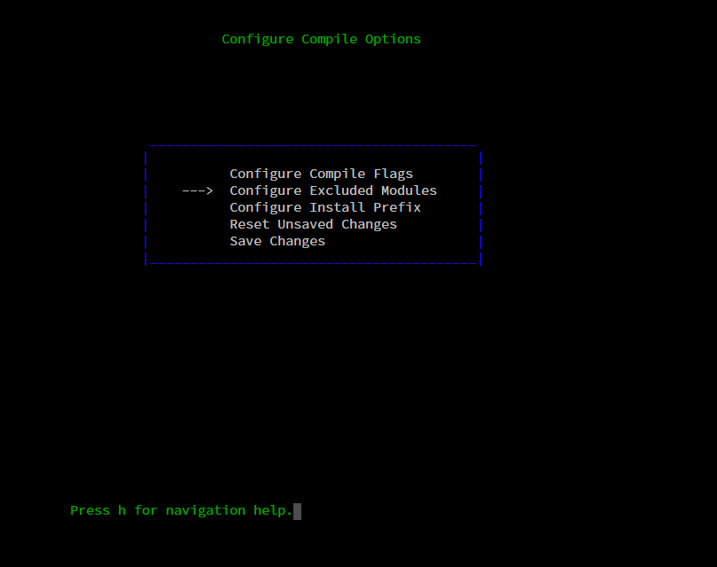
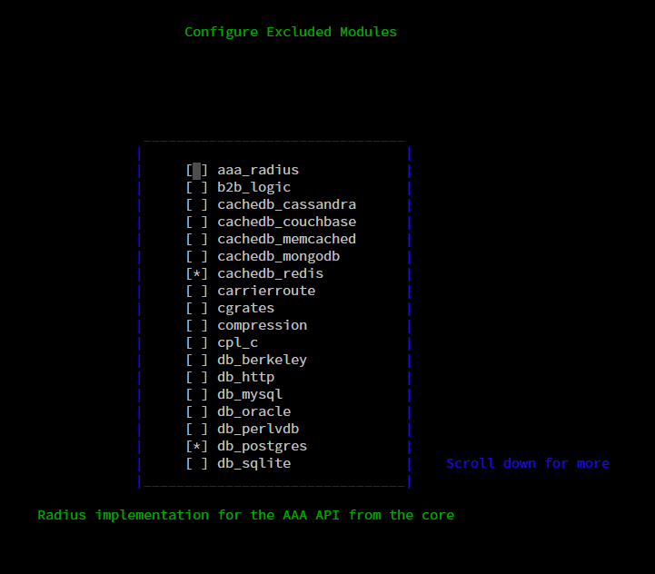

# Debian 10 编译安装 OpenSIPS 2.4.11

### 1、前期准备
*  Debian 10.10
*  PostgreSQL 9.6
*  下载源码
```shell
 wget https://opensips.org/pub/opensips/2.4.11/opensips-2.4.11.tar.gz
```

### 2、编译依赖环境
```shell
# 个人是在freeswitch 编译依赖环境上再安装flex
apt-get update && apt-get install -yq gnupg2 wget lsb-release 
wget -O - https://files.freeswitch.org/repo/deb/debian-release/fsstretch-archive-keyring.asc | apt-key add - 
echo "deb http://files.freeswitch.org/repo/deb/debian-release/ `lsb_release -sc` main" > /etc/apt/sources.list.d/freeswitch.list 

echo "deb-src http://files.freeswitch.org/repo/deb/debian-release/ `lsb_release -sc` main" >> /etc/apt/sources.list.d/freeswitch.list 

apt-get update 
apt-get build-dep freeswitch

# 可在freeswitch依赖环境上，再安装flex
apt-get install flex
```

### 3、编译源码
```shell
# compile
make all

# 创建目录
mkdir -p  /tools/install

# 指定安装路径: /tools/install/opensips，执行后会进入引导页面
make prefix=/tools/install/opensips menuconfig
```

### 4、引导页面选择需要的模块安装
* Configure Compile Options
    * Configure Excluded Modules
        * proto_tls
        * proto_wss
        * tls_mgm
        * db_postgres
* Compile And Install OpenSIPS

（左右键进入返回，空格键选中（*），回车键确定）





### 5、配置数据源
修改配置文件：/tools/install/opensips/etc/opensips/opensipsctlrc
```
DBENGINE=PGSQL            #数据库类型，根据自己环境修改
DBPORT=5432                    #数据库端口，根据自己环境修改
DBHOST=192.168.10.114   #数据库地址，根据自己环境修改
DBNAME=opensips             #数据库名称，根据自己环境修改
DBRWUSER=opensips       #数据库用户，根据自己环境修改
DBRWPW="123456"           #数据库密码，根据自己环境修改
```

### 6、初始化数据库（不需要手动创建pgsql 数据库、账号，执行opensipsdbctl后会自动生成）
```shell
# 配置 ~/.pgpass
vi  ~/.pgpass

# 在 ~/.pgpass 添加 opensips 的 PostgreSQL 配置
# host:port:dbname:dbuser:password
192.168.10.114:5432:opensips:opensips:Aa123456@zx

# 赋予权限
chmod 0600 ~/.pgpass

# 执行，其中opensips 对应 ~/.pgpass中的 dbname  (database)
cd /tools/install/opensips/sbin
./opensipsdbctl create opensips
```

### 7、启动
``` shell
#优化
# 进程内使用的内存PKG，提供的三个API包括： -M
# 进程间使用的内存SHM：  -m
# udp_children_no子进程个数： -n
# tcp_children_no子进程个数： -N

## 修改配置文件/tools/install/opensips/sbin/opensipsctlrc 添加：
STARTOPTIONS="-m 1024 -M 16 -N 8 -n 8"

#启动
cd /tools/install/opensips/sbin
./opensipsctl start
```
